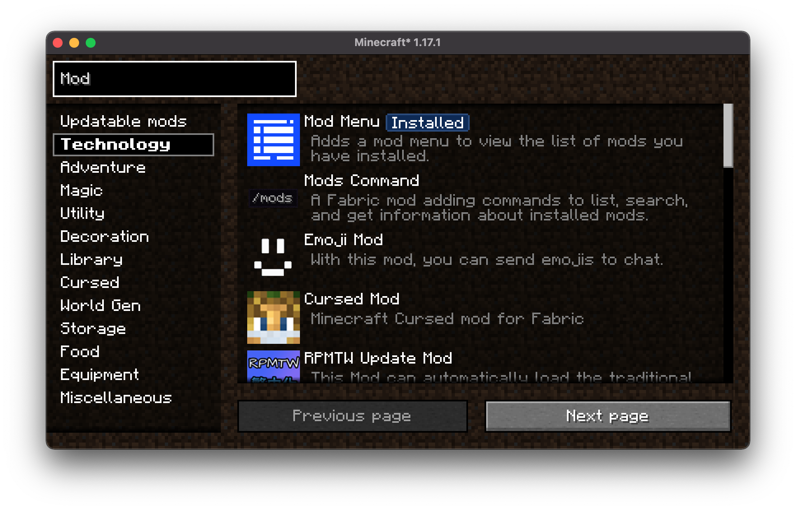
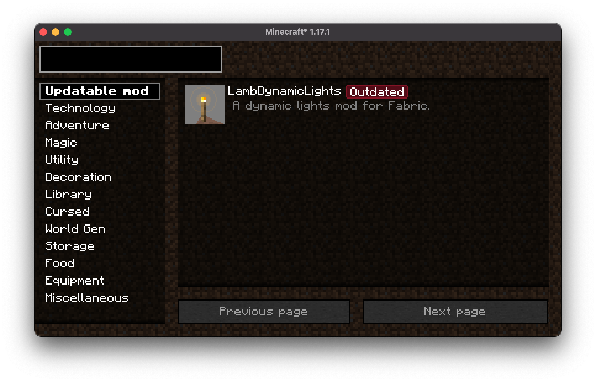

# ModManager

Extends [Mod Menu](https://github.com/TerraformersMC/ModMenu) with a new tab for installing,
removing and updating mods.

Features:
* Browse through Modrinth in minecraft
* Install, remove and update mods in minecraft (needs restart to apply changes)
* Notify about outdated mods
* Show a list of all outdated mods

### Screenshots

Search view:

Updatable mods list:

### Credits

- [Prospector](https://github.com/Prospector) for creating ModMenu
- [Modrinth](https://modrinth.com) for creating a public and easy to use API for searching mods
